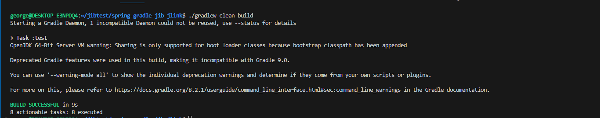
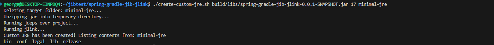
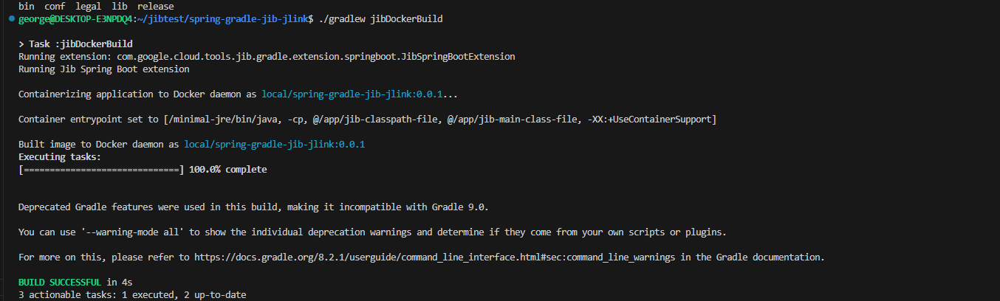
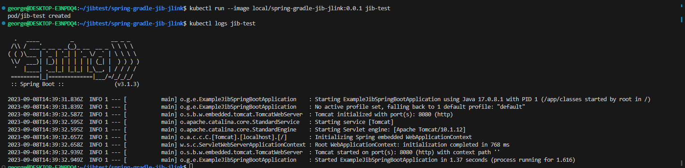

# Minimal Spring Boot gradle configuration

This repository was created as a minimal reproducible example of a problem I encountered while trying to use the Jib Gradle plugin
in combination with some scripts and a distroless image in order to produce a custom Docker image for a Spring Boot application by using jdeps & jlink
to create a minimal jre for running the application.

This project may be used by anyone as an example of how to create a custom jre for a Spring Boot application and then use it to build a Docker image,
and running it locally.

# Pre-requirements

- first would be Git (for cloning the repo, or you can just download as zip and unpack it somewhere);
- second would be a JDK 17 ( I have used the [AdoptOpenJDK](https://adoptopenjdk.net/) version) installed and configured, necessary for running the jdeps/jlink commands;
- third would be a WSL/Linux environment to execute the ./create-custom-jre.sh script;
- fourth would be a container runtime (docker preferably, already present in the WSL/Linux environment);

# Usage

Clone the repository locally, preferably in a WSL environment. 
Open a terminal to the root of the project and run the following command:

```bash
./gradlew clean build
```

This will produce the fat jar that will be analyzed by the jdeps command, by the default it will be present in the build/libs directory.



Next run the following command:

```bash

./create-custom-jre.sh build/libs/spring-gradle-jib-jlink-0.0.1-SNAPSHOT.jar 17 minimal-jre

```

Some explanation about the parameters of the script:
- the first parameter is the path to the fat jar produced by the gradle build;
- the second parameter is the JDK version to be used for the jdeps/jlink commands;
- the third parameter is the name of the directory where the custom jre will be created;

You can rename the last parameter to whatever directory name you want, we'll keep minimal-jre as an example.




Now, you should have in the root of your project a new directory called "minimal-jre" that contains the custom jre for your application.

Next, run the following command:

```bash

./gradlew jibDockerBuild

```

This will run the Jib gradle plugin and build the image against the local docker runtime. The image name under which it will be build is present in the build.gradle
file, and it is "local/spring-gradle-jib-jlink:0.0.1".

Something else worth noting is in the Jib configuration from build.gradle, where we copy from the local "minimal-jre" directory into a distroless image
that only contains the minimal jre and nothing else.





Final step is to run the actual image and make sure that you see the normal output for a Spring Boot application, and not any errors. 

For this you can run the following command:

```bash

kubectl run --image local/spring-gradle-jib-jlink:0.0.1 jib-test

```

This will create a pod in your Kubernetes cluster, and you can check the logs of the pod by running the following command:

```bash

kubectl logs jib-test

```




Previously, when running on older Jib gradle plugin, the output of the last command would say that it couldn't find /minimal-jre/bin/java executable file.